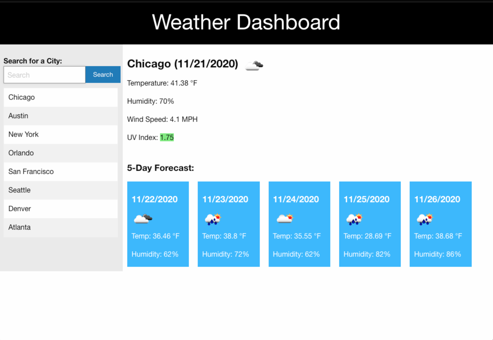
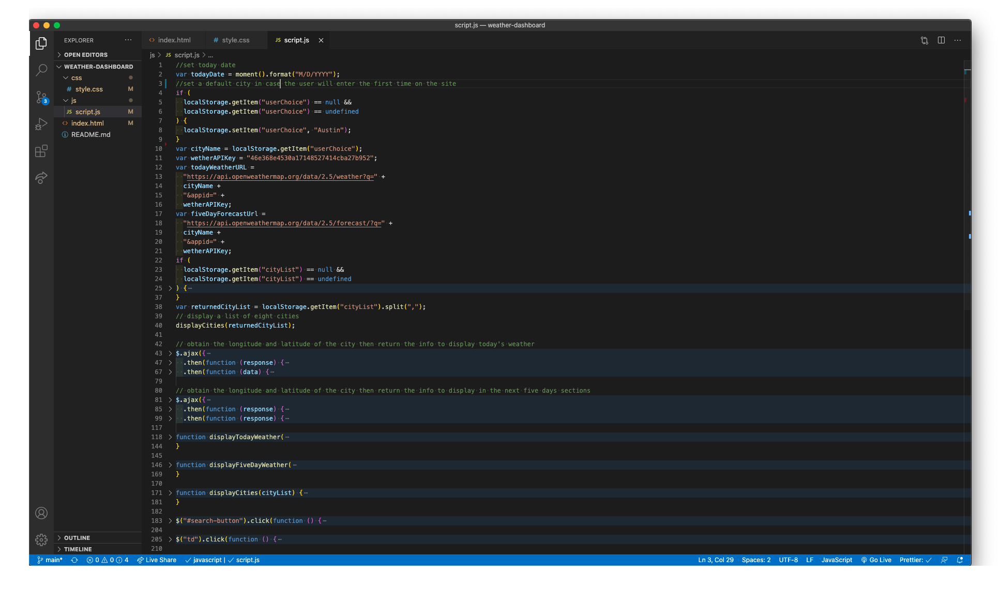

#weather-dashboard

## Description

This site can be used when you need or want to have some outside activities and you need to know what is the weather.
In the top left corner is the search button which can be used to find the weather of a specific city.
Bellow of the search section is a history table with eight big cities that are displayed as default; however, those cities' list will change when the user will search for a different city. Also, all cities in the list has the function of a button and will work as expected.

## JS Code Structure

In my code I tried to be as explicit as possible, and bellow is a screenshot that shows the skeleton of all functionality.

## Deployed link of the site

[Deployed link: https://paveldarii.github.io/weather-dashboard/](https://paveldarii.github.io/weather-dashboard/)

## Copyright

Pavel Darii 2020
